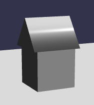

# 2-04 基本的な家 (A Basic House) — ○

> [第2部：村の構築](./README.md) ・ [全体の目次](../README.md)（共通テンプレート・凡例）

**目的**：box を家体、cylinder（`tessellation: 3` の三角柱）を屋根にして組み合わせる。

追加 import：`createArcRotateCamera, attachControl, createHemisphericLight, createBox, createCylinder, createGround, createStandardMaterial`

```typescript
const camera = createArcRotateCamera(-Math.PI / 2, Math.PI / 2.5, 10, { x: 0, y: 0, z: 0 });
scene.camera = camera;
attachControl(camera, canvas, scene);
addToScene(scene, createHemisphericLight([1, 1, 0], 1.0));

// 家体 —— サイズ1の box を接地
const house = createBox(engine, 1);   // createBox の第2引数は数値（一辺の長さ）
house.material = createStandardMaterial();
house.position.y = 0.5;
addToScene(scene, house);

// 屋根 —— tessellation: 3 の三角柱シリンダーを横倒しにして載せる
const roof = createCylinder(engine, { diameter: 1.3, height: 1.2, tessellation: 3 });
roof.material = createStandardMaterial();
roof.scaling.x = 0.75;
roof.rotation.z = Math.PI / 2;   // rotation（Euler）は rotationQuaternion への代入プロキシとしても使える
roof.position.y = 1.22;
addToScene(scene, roof);

const ground = createGround(engine, { width: 10, height: 10 });
ground.material = createStandardMaterial();
addToScene(scene, ground);
```

<iframe src="https://liteplayground.babylonjs.com/snippet/X79RM0/v/4?embed=runner&embedOrigin=https://cx20.github.io"
        title="Babylon Lite Playground: 2-04 基本的な家"
        loading="lazy" allow="fullscreen"
        style="width: 100%; height: 480px; border: 0"></iframe>

本家 Getting Started の完成イメージ（テクスチャ無しの box ＋三角柱の屋根）:



> 画像出典：[Babylon.js Documentation](https://doc.babylonjs.com/features/introductionToFeatures/chap2/variation)（CC BY 4.0）

> 動作確認済みサンプル（Lite Playground）: https://liteplayground.babylonjs.com/snippet/X79RM0/v/4
>
> `createCylinder` はオプションオブジェクト（`{ diameter, height, tessellation }`）をそのまま渡せます（`tessellation` は最小 3 にクランプ）。
> `createBox` だけは第2引数が数値（→ [2-01 の注記](./2-01-grounding.md)）。
>
> **面ごとに別画像**（ドア面・窓面など、Babylon.js の `faceUV`）は box 生成器では未対応の可能性があります → [2-06](./2-06-materials-faceuv.md) 参照。テクスチャを貼る例は次の [2-05](./2-05-add-texture.md) を参照してください。

---

← [2-03 メッシュを設置 (Place and Scale)](./2-03-place-and-scale.md) ・ [2-05 テクスチャを貼る (Add Texture)](./2-05-add-texture.md) →
