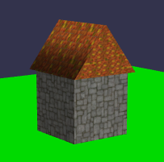

# 2-05 テクスチャを貼る (Add Texture) — ○

> [第2部：村の構築](./README.md) ・ [全体の目次](../README.md)（共通テンプレート・凡例）

**目的**：家（box＋屋根）にテクスチャを、地面に単色を割り当てる。

追加 import：`loadTexture2D`

```typescript
// テクスチャ2枚を registerScene 前にまとめてロード
// ★ Lite の loadTexture2D は async。registerScene / startEngine 前に await し終える必要がある
//   （起動後の後入れはレンダーループのクラッシュ要因）
const [roofTex, floorTex] = await Promise.all([
  loadTexture2D(engine, "https://assets.babylonjs.com/environments/roof.jpg"),
  loadTexture2D(engine, "https://www.babylonjs-playground.com/textures/floor.png"),
]);

// 色マテリアル（Color3 → 配列 [r, g, b]）
const groundMat = createStandardMaterial();
groundMat.diffuseColor = [0, 1, 0];
ground.material = groundMat;

// テクスチャマテリアル
const roofMat = createStandardMaterial();
roofMat.diffuseTexture = roofTex;
roof.material = roofMat;

const houseMat = createStandardMaterial();
houseMat.diffuseTexture = floorTex;
house.material = houseMat;
```

<iframe src="https://liteplayground.babylonjs.com/snippet/X79RM0/v/5?embed=runner&embedOrigin=https://cx20.github.io"
        title="Babylon Lite Playground: 2-05 テクスチャを貼る"
        loading="lazy" allow="fullscreen"
        style="width: 100%; height: 480px; border: 0"></iframe>

本家 Getting Started の完成イメージ（家体に石壁テクスチャ、屋根に瓦テクスチャを貼った状態）:



> 画像出典：[Babylon.js Documentation](https://doc.babylonjs.com/features/introductionToFeatures/chap2/materials)（CC BY 4.0）

> 動作確認済みサンプル（Lite Playground）: https://liteplayground.babylonjs.com/snippet/X79RM0/v/5
>
> Lite の `StandardMaterial` は各種テクスチャに対応します（v1.28.0 のソースで確認）。
> **本章で使う `diffuseTexture` だけが従来どおりの代入**で、**それ以外の任意テクスチャは v1.22.0 でセッター関数に変わりました**
> （代入は**コンパイルエラー**。拡張の登録をスキップして「何も描かれない」事態を防ぐための変更で、互換シムはありません）：
>
> | 〜v1.21.0（旧・代入） | v1.22.0〜（セッター関数） |
> |---|---|
> | `mat.emissiveTexture = tex` | `setStandardEmissiveTexture(mat, tex)` |
> | `mat.bumpTexture = tex`（法線マップ、`bumpLevel`） | `setStandardBumpTexture(mat, tex)` |
> | `mat.specularTexture = tex` | `setStandardSpecularTexture(mat, tex)` |
> | `mat.ambientTexture = tex` | `setStandardAmbientTexture(mat, tex)` |
> | `mat.lightmapTexture = tex` | `setStandardLightmapTexture(mat, tex)` |
> | `mat.opacityTexture = tex`（→ 5-01 の透過） | `setStandardOpacityTexture(mat, tex)` |
> | `mat.reflectionTexture = tex` | `setStandardReflectionTexture(mat, tex)` |
> | `mat.reflectionCubeTexture = cube` | `setStandardReflectionCubeTexture(mat, cube)` |
>
> 強度・座標系のフィールド（`bumpLevel` / `opacityLevel` / `opacityFromRGB` / `reflectionLevel` など）は代入のまま残ります。
> 色も従来どおり `diffuseColor` / `emissiveColor` / `specularColor` / `ambientColor`（いずれも `[r, g, b]`）です。
>
> **UV タイリングは 2 系統あります**。マテリアル側の **`material.uvScale: [u, v]`**（既定 `[1, 1]`）は Lite 独自の簡易版で、
> 本章のようにタイリングだけなら最短です。**v1.21.0 からは本家と同じテクスチャ側の
> `uScale` / `vScale` / `uOffset` / `vOffset` / `uAng`** も使えます（BJS と同じ意味論）。
> 手書きマテリアルでは**初回ビルド前に `enableMaterialUvTransform(mat)` を 1 回呼ぶ opt-in が必要**で
> （glTF の PBR マテリアルはローダーが自動で有効化）、Standard は renderable のビルド時に値を読むため
> 後から変えるには `rebuildMaterial` が要ります（PBR は `markMaterialUboDirty` で更新可）。

---

← [2-04 基本的な家 (A Basic House)](./2-04-basic-house.md) ・ [2-06 マテリアル（面ごと/faceUV）](./2-06-materials-faceuv.md) →
