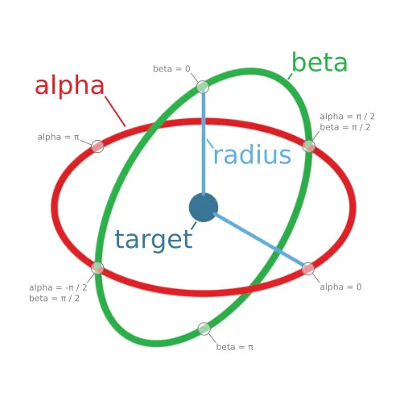

# 8-01 見回す (Have a Look Around) — ○

> [第8部：世界の見方](./README.md) ・ [全体の目次](../README.md)（共通テンプレート・凡例）

**目的**：村を巡回する Xbot を、肩越しのカメラが追いかける。あわせてヤシの木をスプライト（カメラ正対ビルボード）で 1000 本配置する。この章は本家も影なし・ヘミスフェリックライトのみです。

**Lite 対応方針**（v1.8 ソースで確認）。本家は `camera.parent = dude` でカメラをキャラに親子付けしますが、Lite でそのまま親子付けするとビュー行列が反転して面のカリングが崩れます。ここでは**親子付けの実効挙動をエミュレート**するのがポイントです。

### `camera.parent = dude` を直接使わずエミュレートする

Lite にも `camera.parent`（`IParentable`）はありますが、glTF のキャラは合成ルート `__root__` の**ミラー空間（`scale(-1,1,1)`）配下**にいるため、そこへ親子付けするとビュー行列が反転して面の向き（カリング）が崩れます。そこで本家の親子付けと同じ見え方を、`ArcRotateCamera` の 2 操作で再現します。

1. **毎フレーム `camera.target` をキャラのワールド位置＋頭上オフセットに更新**する（ワールド位置は `dude.worldMatrix` の平行移動成分から直接取得＝`__root__` の符号仮定に依存しない）。
2. **キャラが転回する瞬間に `camera.alpha -= Δyaw`** する。`α = π/2 - yaw` を維持するとカメラは常に進行方向の背後に来ます。ユーザーのドラッグ操作によるオフセットは `α` に加算されたまま残るので、**本家の親子付けと同じくマウス操作も可能**です。

本家の `radius=150` / `target(0,60,0)` は「親（0.008 倍）のローカル値」で、ワールド換算すると `radius≈1.2` / 高さ≈0.48。こちらのキャラ（高さ≈0.92）に合わせて `radius=2.2` / 高さ=0.85 にしています。

参考：`ArcRotateCamera` の `alpha`（経度）/ `beta`（緯度）/ `radius`（`target` からの距離）/ `target`（注視点）の関係。上の `α = π/2 - yaw` はこの `alpha` を指します。



> 画像出典：[Babylon.js Documentation](https://doc.babylonjs.com/features/introductionToFeatures/chap8/camera)（CC BY 4.0）

### ヤシの木はスプライト（本家 `SpriteManager` 相当）

本家の `SpriteManager("palm.png", …)` は、`loadSpriteAtlas(palm.png, gridSize=画像全体)` で単一フレームのアトラスにし、`createFacingBillboardSystem`（カメラ正対＝BJS Sprite の向き規則）へ `addBillboardSpriteIndex` で 1000 本追加します。`position` / `sizeWorld`（y=0.5・1×1 ユニット・乱数レンジ）は本家と同一です。

### 巡回・向き・スカイボックスは前章の規約を流用

キャラの巡回コース・向きの制御・スカイボックスは、[7-03 影を追加](../07-lights/7-03-shadows.md#応用村を歩き回るキャラクター--影)で確立した規約をそのまま使います（bake クォータニオン合成／`world yaw φ`・`forward=(-sinφ,0,-cosφ)`・`__root__` の x 反転変換／コンテナ丸ごと `addToScene`＋`walk` 切り替え／`loadSkybox(…, 1000)`＋`farPlane 2000`）。

## メインコード

```typescript
/********************************************************************
 * Getting Started: Have a Look Around（追従カメラ） — Babylon Lite 移植版
 * ------------------------------------------------------------------
 * 村を巡回する Xbot を、肩越しのカメラが追いかける。木はスプライト
 * （カメラ正対ビルボード）を1000本配置。この章は本家も影なし・
 * ヘミスフェリックライトのみ。
 *
 * ── 追従カメラ（本家 camera.parent = dude の Lite 対応）─────────
 *   Lite にも camera.parent(IParentable) はあるが、glTF のキャラは
 *   __root__ のミラー空間(scale(-1,1,1))配下にいるため、そこへ親子付け
 *   するとビュー行列が反転して面の向き(カリング)が崩れる。
 *   そこで BJS 親子付けの実効挙動を次でエミュレートする:
 *     (a) 毎フレーム camera.target = キャラのワールド位置 + 頭上オフセット
 *         （ワールド位置は dude.worldMatrix の平行移動成分から直接取得）
 *     (b) キャラが転回する瞬間に camera.alpha -= Δyaw
 *         （カメラの経度がキャラと一緒に回る。α = π/2 - yaw を維持すると
 *          カメラは常に進行方向の背後。ユーザーのドラッグ操作による
 *          オフセットは α に加算されたまま残るので、BJS の親子付けと
 *          同じくマウス操作可能）
 *   本家の radius=150 / target(0,60,0) は「親(0.008倍)のローカル値」で、
 *   ワールド換算 radius≈1.2 / 高さ≈0.48。こちらのキャラ(高さ≈0.92)に
 *   合わせ radius=2.2 / 高さ=0.85 とした。
 *
 * ── スプライトの木（本家 SpriteManager 相当）──────────────────
 *   loadSpriteAtlas(palm.png, gridSize=画像全体) → 単一フレームの
 *   アトラスにし、createFacingBillboardSystem（カメラ正対＝BJS Sprite の
 *   向き規則）へ addBillboardSpriteIndex で 1000 本。position/sizeWorld は
 *   本家と同じ（y=0.5・1×1ユニット・乱数レンジも同一）。
 *
 * ── 巡回・向き・スカイボックス ─────────────────────────────
 *   前章までに確立した規約をそのまま使用:
 *   - bake クォータニオン合成（rotation.y 代入は bake を壊す）
 *   - world yaw φ / forward=(-sinφ,0,-cosφ) / __root__ x反転の変換
 *   - コンテナ丸ごと addToScene + walk 切り替え
 *   - loadSkybox("textures/skybox", ".jpg", 1000) + farPlane 2000
 *     （箱サイズ既定100だと valleyvillage の地形を覆えず帯が見える）
 ********************************************************************/
import {
    addBillboardSpriteIndex,
    addFacingBillboardSystem,
    addToScene,
    attachControl,
    createArcRotateCamera,
    createFacingBillboardSystem,
    createHemisphericLight,
    createSceneContext,
    createEngine,
    loadGltf,
    loadSkybox,
    loadSpriteAtlas,
    onBeforeRender,
    playAnimation,
    registerScene,
    startEngine,
    stopAnimation,
    type AnimationGroup,
    type AssetContainer,
    type EngineContext,
    type SceneContext,
    type SceneNode,
} from "@babylonjs/lite";

const VILLAGE_URL = "https://assets.babylonjs.com/meshes/valleyvillage.glb";
const XBOT_URL = "https://playground.babylonjs.com/scenes/Xbot.glb";
const PALM_URL = "https://playground.babylonjs.com/textures/palm.png";
const SKYBOX_BASE = "https://playground.babylonjs.com/textures/skybox";

const toRad = (deg: number): number => (deg * Math.PI) / 180;

/** 巡回コース（本家と同一） */
const TRACK: ReadonlyArray<{ turn: number; dist: number }> = [
    { turn: 86, dist: 7 },
    { turn: -85, dist: 14.8 },
    { turn: -93, dist: 16.5 },
    { turn: 48, dist: 25.5 },
    { turn: -112, dist: 30.5 },
    { turn: -72, dist: 33.2 },
    { turn: 42, dist: 37.5 },
    { turn: -98, dist: 45.2 },
    { turn: 0, dist: 47 },
];

function requireGroup(groups: readonly AnimationGroup[], name: string): AnimationGroup {
    const group = groups.find((g) => g.name === name);
    if (!group) {
        throw new Error(`アニメーション "${name}" が見つかりません`);
    }
    return group;
}

function findNode(container: AssetContainer, name: string): SceneNode {
    const visit = (node: SceneNode): SceneNode | null => {
        if (node.name === name) {
            return node;
        }
        for (const child of node.children ?? []) {
            const found = visit(child);
            if (found) {
                return found;
            }
        }
        return null;
    };
    for (const entity of container.entities) {
        if ("children" in (entity as object)) {
            const found = visit(entity as SceneNode);
            if (found) {
                return found;
            }
        }
    }
    throw new Error(`ノード "${name}" が見つかりません`);
}

async function createScene(engine: EngineContext, canvas: HTMLCanvasElement): Promise<SceneContext> {
    const scene = createSceneContext(engine);
    scene.clearColor = { r: 0.53, g: 0.75, b: 0.92, a: 1.0 }; // スカイボックス失敗時の空色

    // 追従カメラの定数（本家 radius150/target(0,60,0)＝親0.008倍のワールド換算を
    // こちらのキャラサイズ(高さ≈0.92)へスケール合わせしたもの）
    const CAM_RADIUS = 2.2;
    const CAM_TARGET_HEIGHT = 0.85;

    // カメラ。α = π/2 - yaw を維持するとキャラの背後に位置する。
    const camera = createArcRotateCamera(0, Math.PI / 2.5, CAM_RADIUS, { x: 0, y: CAM_TARGET_HEIGHT, z: 0 });
    camera.nearPlane = 0.1;
    camera.farPlane = 2000; // スカイボックス(1000)より十分遠くまで描画
    scene.camera = camera;
    attachControl(camera, canvas, scene);

    // ヘミスフェリックライト（本家と同一: direction=(1,1,0)。この章は影なし）
    addToScene(scene, createHemisphericLight([1, 1, 0], 1));

    // 村（コンテナ丸ごと追加）
    const village = await loadGltf(engine, VILLAGE_URL);
    addToScene(scene, village);

    // Xbot（コンテナ丸ごと追加 → walk へ切り替え）
    const xbot = await loadGltf(engine, XBOT_URL);
    addToScene(scene, xbot);
    const groups = xbot.animationGroups ?? [];
    for (const g of groups) {
        stopAnimation(g);
    }
    playAnimation(requireGroup(groups, "walk"));

    // 巡回の駆動ノード（bake クォータニオン保持）。半分サイズに。
    const dude = findNode(xbot, "Xbot");
    const bake = { x: dude.rotationQuaternion.x, y: dude.rotationQuaternion.y, z: dude.rotationQuaternion.z, w: dude.rotationQuaternion.w };
    const CHAR_SCALE = 0.5;
    const ds = dude.scaling;
    ds.set(ds.x * CHAR_SCALE, ds.y * CHAR_SCALE, ds.z * CHAR_SCALE);

    // 初期状態（ワールド意図: 位置(-6,0,0)・yaw -95°）→ ローカルへ（x反転）
    const START_YAW = toRad(-95);
    let yaw = START_YAW;
    dude.position.set(6, 0, 0);

    const applyHeading = (): void => {
        const psi = Math.PI - yaw; // 正面180°オフセット + x反転の符号反転
        const sy = Math.sin(psi / 2);
        const cy = Math.cos(psi / 2);
        dude.rotationQuaternion.set(
            cy * bake.x + sy * bake.z,
            cy * bake.y + sy * bake.w,
            cy * bake.z - sy * bake.x,
            cy * bake.w - sy * bake.y
        );
    };

    /** 転回（本家 dude.rotate 相当）＋カメラの連れ回し（本家 parent 相当） */
    const applyTurn = (deltaYawRad: number): void => {
        yaw += deltaYawRad;
        camera.alpha -= deltaYawRad; // α = π/2 - yaw の関係を保つ（ドラッグ分は温存）
        applyHeading();
    };

    applyHeading();
    camera.alpha = Math.PI / 2 - yaw; // 初期はキャラの真後ろ

    // スプライトの木（本家 SpriteManager("palm.png", 2000, {512,1024}) 相当）
    const palmAtlas = await loadSpriteAtlas(engine, PALM_URL, {
        gridSize: [512, 1024], // 画像全体を1フレームに
        sampling: "linear",
    });
    const trees = createFacingBillboardSystem(palmAtlas, { capacity: 1000 });
    for (let i = 0; i < 500; i++) {
        addBillboardSpriteIndex(trees, {
            position: [Math.random() * -30, 0.5, Math.random() * 20 + 8],
            sizeWorld: [1, 1], // BJS Sprite の既定サイズと同じ
        });
    }
    for (let i = 0; i < 500; i++) {
        addBillboardSpriteIndex(trees, {
            position: [Math.random() * 25 + 7, 0.5, Math.random() * -35 + 8],
            sizeWorld: [1, 1],
        });
    }
    addFacingBillboardSystem(scene, trees);

    // 巡回＋カメラ追従（本家 onBeforeRenderObservable 相当）
    let distance = 0;
    const STEP = 0.015; // この章の本家値
    let p = 0;
    onBeforeRender(scene, () => {
        // 本家 upperBetaLimit = π/2.2 の再現
        if (camera.beta > Math.PI / 2.2) {
            camera.beta = Math.PI / 2.2;
        }

        // 移動（world forward=(-sinφ,0,-cosφ) → local へは x 反転）
        dude.position.x += Math.sin(yaw) * STEP;
        dude.position.z += -Math.cos(yaw) * STEP;
        distance += STEP;

        if (distance > TRACK[p]!.dist) {
            applyTurn(toRad(TRACK[p]!.turn));
            p = (p + 1) % TRACK.length;
            if (p === 0) {
                // 一周 → 初期状態へ（yaw もカメラも applyTurn 経由で巻き戻す）
                distance = 0;
                dude.position.set(6, 0, 0);
                applyTurn(START_YAW - yaw);
            }
        }

        // カメラのターゲットをキャラの頭上へ（本家 parent + target(0,60,0) 相当）
        const w = dude.worldMatrix as unknown as ArrayLike<number>;
        camera.target.x = w[12]!;
        camera.target.y = w[13]! + CAM_TARGET_HEIGHT;
        camera.target.z = w[14]!;
    });

    return scene;
}

async function main(): Promise<void> {
    const canvas = document.getElementById("renderCanvas") as HTMLCanvasElement | null;
    if (!canvas) {
        throw new Error('Canvas要素 "#renderCanvas" が見つかりません。');
    }
    const engine = await createEngine(canvas);
    const scene = await createScene(engine, canvas);

    // スカイボックス（本家 CubeTexture("textures/skybox") と同じ6枚jpg）
    try {
        await loadSkybox(scene, SKYBOX_BASE, ".jpg", 1000);
    } catch (e) {
        console.warn("スカイボックスの読み込みに失敗（clearColor で続行）:", e);
    }
    scene.clearColor = { r: 0.53, g: 0.75, b: 0.92, a: 1.0 };

    await registerScene(scene);
    await startEngine(engine);
}

main().catch((error: unknown) => {
    console.error("シーンの構築に失敗しました:", error);
});
```

## 動作サンプル

<iframe src="https://liteplayground.babylonjs.com/snippet/O42L06/v/2?embed=runner&embedOrigin=https://cx20.github.io"
        title="Babylon Lite Playground: 8-01 見回す（キャラを追う肩越しカメラ）"
        loading="lazy" allow="fullscreen"
        style="width: 100%; height: 480px; border: 0"></iframe>

> 動作確認済みサンプル（Lite Playground）: https://liteplayground.babylonjs.com/snippet/O42L06/v/2
>
> 村を巡回する Xbot を肩越しのカメラが追いかけ、周囲にヤシの木スプライトを 1000 本配置します。Lite にキャラへの直接親子付けは不向き（ミラー空間でカリングが崩れる）なので、**毎フレーム `camera.target` をキャラのワールド位置へ更新**し、**転回時に `camera.alpha -= Δyaw`** することで本家 `camera.parent = dude` と同じ肩越し追従（＋マウス操作）を再現します。木は `loadSpriteAtlas` ＋ `createFacingBillboardSystem` でカメラ正対ビルボードとして描きます。

---

← [8-00 世界の見方 (Ways to See The World)](./8-00-cameras-intro.md) ・ [8-02 キャラを追う (Follow That Character)](./8-02-follow-character.md) →
